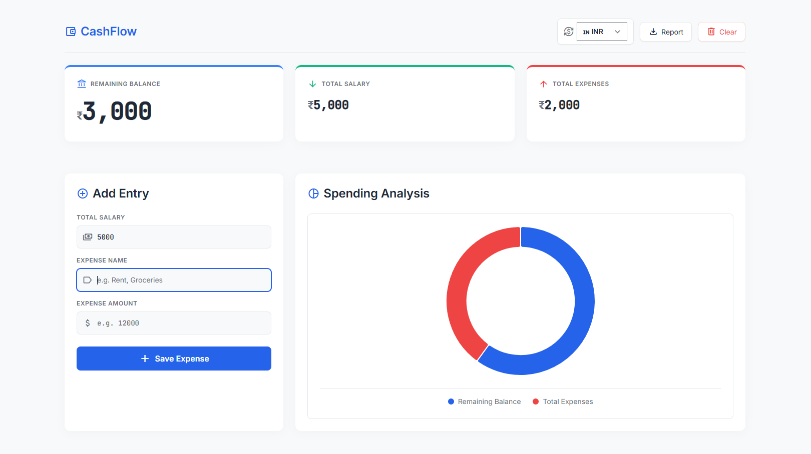

# Cash-Flow Dashboard

**Live Link:** [https://prodesk-nq6c.vercel.app/](https://prodesk-nq6c.vercel.app/)

Cash-Flow is a premium salary and expense tracking dashboard designed to help users manage their personal finances effectively. 

## Features
- **Income & Expense Tracking:** Log your total salary and track daily expenses.
- **Real-Time Financial State:** Visualizes your remaining balance, total salary, and total expenses through interactive summary cards and a dynamic doughnut chart.
- **Data Persistence:** Automatically saves your financial data in the browser's LocalStorage.
- **Multi-Currency Support:** Switch between popular currencies (INR, USD, EUR, GBP) seamlessly.
- **PDF Export:** Download detailed PDF reports of your expenses.
- **Pristine Light UI:** A clean, modern Light theme interface powered by Tailwind CSS and Material Symbols.

## Technologies Used
- HTML5 / CSS3 (Tailwind CSS via CDN)
- Vanilla JavaScript
- Chart.js (for visualizations)
- jsPDF (for report generation)
- Material Symbols (for iconography)

## Usage
Simply open `index.html` in any modern web browser to start using the application. No complex backend or build tools are required!
